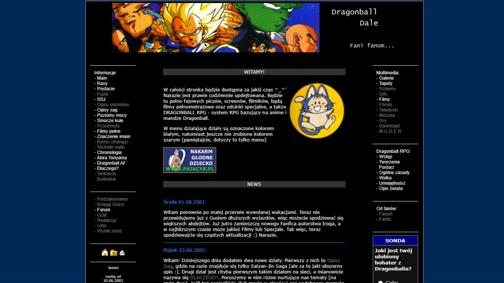

I'm gonna tell you a story about why Claude Code is amazing. Yesterday, a childhood friend messaged me. As childhood friend as childhood friends go — I've known him for almost 40 years, because we met in kindergarten when we were three. Life goes different ways, and what used to be hanging out every day turned into seeing each other twice a year around holidays or when visiting our parents. So when he hit me up on WhatsApp after months of silence, I was very excited. I opened the message and immediately got suspicious. Because like… what? Marcin sends a file called "DB_BEZ_RAMEK.RAR" and writes: "Open"? I was worried.

I replied: "Prove you're Marcin."

Marcin goes: "No. Risk it"

And because that was exactly what he would have said, I opened it. What I saw was a folder with a website straight out of the Web 1.0 era. I opened INDEX.html and stared in wonder. A cool Dragon Ball fan-site. I thought Marcin had found one of those zipped sites we used to download so we could read offline and not burn through too many phone impulses :) But reading this gorgeous little gem, I got this weird, familiar déjà vu — I knew this site from somewhere, like really well, but I couldn't place it in my memory palace. Nowhere.

I keep reading and I see more familiar stuff, and then I scroll to the footer, and there it is: "(c)opyright by Eljot&Gusio 2001 All Rights Reserved - www\_dbdaleprv\_pl" Those are our internet nicknames from that era, which suggests this is my and Marcin's site. But I don't remember us making this at all! I told Marcin that, and he said that indeed, we made this; he built the site and I wrote the content. Apparently.

He kept talking and talking, and with every minute I remembered more. I could see my writing style, my cringe dad jokes, the way I spelled certain words, references to people from our lives 25 years ago that I'd completely forgotten… but the biggest memory parade hit when I got to the right-side menu with the "Dragon Ball RPG" section. And then I remembered everything. I remembered how for months (probably the whole summer) we sat with our friend group and designed an (pen & paper) RPG game in the Dragon Ball universe. How we tested mechanics, hunted bugs/exploits, did playtests, and then played it like it was Warhammer or World of Darkness and not some silly homebrew ruleset kept together by duct tape.

I thought I'd forgotten, but those memories were still there, they just needed unlocking. And if Marcin weren't a total weirdo and didn't keep stuff like this on his hard drive, it would've been lost to the fog of history.

But what does this have to do with Claude Code? Well, this gem of a website can't just sit in a folder on our disks, can it? So I asked CC what the simplest way was to show it to the world. 15 minutes later (and most of that was fixing broken images, Polish characters, the poll, and a couple other things) I had a working site up on GitHub Pages, ready to share.

Here it is: [dbdale-time-capsule](https://risukisu.github.io/dbdale-time-capsule/index2.htm "Dragon Ball fan-site from 2001, restored and hosted on GitHub Pages")

Opowiem Wam historię o tym, dlaczego Claude Code jest super. Napisał do mnie wczoraj przyjaciel z dzieciństwa. Taki, którego znam od prawie 40 lat ponieważ poznaliśmy się w przedszkolu w wieku lat trzech. Życie układa się różnie, i to co kiedyś było codziennym spędzaniem czasu zmieniło się spotkania przy okazji świąt albo wizyt u rodziców. Także gdy napisał na Whatsappie po pół roku nie pisania byłem podekscytowany. Otworzyłem wiadomość i nabrałem podejrzeń. No bo co? Marcin przesyła plik "DB\_BEZ\_RAMEK.RAR" i pisze: "Otwórz"? Byłem zaniepokojony.

Odpisałem: Udowodnij, że jesteś Marcinem.

Marcin na to: Nie. Ryzykuj.

A ponieważ było to bardzo w stylu Marcina, otworzyłem. I oczom moim ukazał się folder ze stroną internetową z epoki web 1.0. Otworzyłem INDEX.html i oniemiałem. No super strona o Dragon Ballu, jednej z moich pasji z wieku nastoletniego. Pomyślałem, że Marcin znalazł spakowaną stronkę, które często pobieraliśmy, żeby czytać offline i nie zużywać za dużo impulsów telefonicznych :) Ale czytając ten wspaniały klejnot poczułem takie dziwne, znajome déjà vu — znałem skądś tę stronę, dobrze, ale nie potrafiłem umiejscowić jej w pałacu wspomnień. Nigdzie.

Czytam dalej i widzę wiecej znajomych elementów, a potem dojeżdżam do stopki, a tam: "(c)opyright by Eljot&Gusio 2001 All Rights Reserved - www\_dbdaleprv\_pl"

To nasze nicki internetowe z tamtej ery (nie pytajcie, proszę xD) co sugeruje, że to moja i Marcina strona. Ale ja nie pamiętam w ogóle, żebyśmy taką stronę robili! Napisałem Marcinowi własnie to na co stwierdził, że przecież tak — on robił stronę a ja pisałem content.

Opowiadał i opowiadał a ja z każdą chwilą przypomniałem sobie coraz więcej. Widziałem swój styl pisania, krindżowe dad jokes, sposób zapisywania pewnych słów, odniesienia do osób z naszego życia sprzed 25 lat, o których już zapomniałem, ale największą paradę wspomnień uruchomiłem jak dotarłem do menu po prawej stronie z sekcją — "Dragon Ball RPG". Wtedy sobie przypomniałem wszystko. Przypomniałem sobie jak miesiącami (chyba całe wakacje) siedzieliśmy z naszą ówczesną ekipą i projektowaliśmy grę RPG w świecie dragon balla, jak testowaliśmy mechaniki, szukaliśmy bugów/exploitów, robiliśmy play testy a potem — graliśmy jakby to był Warhammer czy Świat Mroku, a nie domowy system RPG posklejany taśmą.

Niby zapomniałem, ale te wspomnienia tam były, trzeba je było tylko odblokować, i gdyby Marcin nie był świrem i nie trzymał takich rzeczy na dysku, zaginęło by to w pomrokach dziejów. Strasznie się wzruszyłem.

Ale co z tym Claude Code? Otóż, taka wspaniała kapsuła czasu nie może niszczeć w folderze na naszych dyskach. Zapytałem więc CC jak najprościej ją pokazać światu. 15 minut później, gdzie najwięcej zajęło naprawienia nie działających obrazków, polskich znaków, ankiety i jeszcze kilku elementów, miałem działającą i wystawioną na github pages stronę, którą mogę pokazać światu.

Oto ona: [dbdale-time-capsule](https://risukisu.github.io/dbdale-time-capsule/index2.htm "Strona o Dragon Ballu z 2001 roku, przywrócona i hostowana na GitHub Pages")

