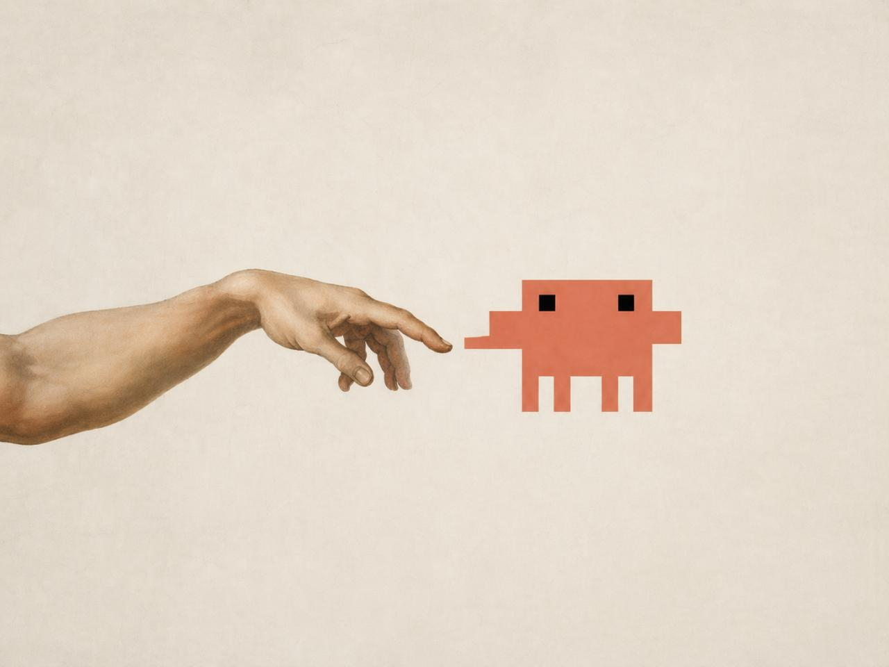

Back in February 2026 [I fell in love with Claude Code](https://risu.pl/blog/how-to-revive-a-25-year-old-website/ "A childhood friend sends a mysterious .RAR file. Inside: a Dragon Ball fan-site we built in 2001 that I had completely forgotten about."). It's hard to describe now how I felt then. Asking an AI agent to help you do something that you felt would take weeks, and seeing it do it, in front of your eyes, in no time at all, felt like magic. Like touching the absolute.

So I dived right in, make a [github account](https://github.com/risukisu "My GitHub profile — where everything I build ends up.") (every marketer should have one by the way, change my mind) and started building everything that I thought of.

I created this very blog as one of the first things, I built [SkillCraft](https://skillcraft.cloud/ "SkillCraft — a public marketplace for Claude skills. Browse and download without an account."), started experimenting with [simple dashboards to show some Google Analytics stats](https://github.com/risukisu/vanilla-stats "vanilla-stats — my experiment in putting Google Analytics numbers on a plain, simple dashboard."), and a dozen or so internal work tools I can't share here. I experimented with harnesses, then decided to build my own, that meets my skills. I [pimped out my terminal](https://github.com/risukisu/claude-code-statusline "claude-code-statusline — a 3-line micro-dashboard for the Claude Code terminal. Zero dependencies, MIT.") to show a micro-dashboard with the stats I cared about, like always knowing which model I am using at any moment and what my limits are (after I got pissed off when Claude Code changed the default model to Sonnet, when I wanted Opus, and I haven't realized for weeks, but that's a story for another day lol). It's been a fantastic journey so far, and every day something new from the AI land amazes and inspires me.

I LOVE AI! 🩵

<figure>

<figcaption>Me, meeting Claude Code for the first time, February 2026 (colorized)</figcaption>

</figure>

But I also HATE AI.

I hate that people seem to be using AI for what they shouldn't be using it and *vice versa*, they don't use it when they should! I hate it when I ask a question or start a thread on Slack, and in reply I get a paste-response from an LLM.

It woudn't be all bad if people told the AI something like "hey, Andrzej asked me about this and that, and the answer is that and this; I think the reason is X and we should consider Y, write a polite and concise reply". Instead I am 99% sure they go with "Andrzej wrote 'this', reply" and paste back the hallucinated AI slop full of "it's not X, it's Y" or "load bearing" and it sounds nothing like they talk or write normally.

I hate the fact that AI companies hoovered up the collective human knowledge, scraped all the internet, [scanned and burned books](https://futurism.com/artificial-intelligence/ai-companies-destroying-rare-books "Futurism's report on AI companies destroying rare books.") (OK, not burned but shredded but it's way more dramatic this way!) and the have the audacity to get all protective about their "intellectual property".

I hate the fact that we lose the human connection, that all the crap on the internet I see now a days is AI generated, AI assisted, copied from AI and all that. I want to read imperfect human thoughts and ideas, full of typso and with bad punctuation. The original, unpolished thoughts and above all - opinions! If you open LinkedIn or Twitter all you see if the same shitty words, dressed as opinions but not showing a sliver of creativity or thought, and this is the biggest grips I have with the digital world today.

Outsouring critical thinking is the doom of humanity, and we do it at scale.

LLMs will give you what you ask for. If you tell them to "generate 20 linkedin posts about b2b sales" you get garbage that looks legit (at least to a point), and you even may feel cool for being a through leader for posting all this.

And they will also tell you anything and everything. Prett cool, right? Let's for a moment pretend they never hallucinate or get stuff wrong. Is asking them who was the actor playing in that old movie from 1994, or what year this and that happened? In most cases - no, no it isn't. But you need to be careful, or you end up not calling a friend for an advice, or putting down a budding tableside conversation before it begins and ultimately losing a small piece of humanity you have left. I hate when this happens.

Look, I am all about using AI to automate the boring stuff, or help you parse large amounts of data, or similar things. I haven't touched the native GA4 interface in months, because creating reports, fetching data and interacting with it using natural language conversation witg an AI agent is 100x more pleasant. Checking grammar, or adding hedares formatting in webflow with the help of AI is also very cool. But writing content is leading nowhere, and [it pissed me right off (like most things do)](https://risu.pl/blog/im-angry-all-the-time/ "At almost 42, I realised that being angry at everything is the quiet engine behind most of what I do.") that everyone seems to be doing it.

There's been a lot of opinions about using AI ranging from "AI is a godsend and runs my whole life and businesses" to "AI is the worst, and we immediately must stop using it or the world ends." I don't subscribe to any of those and take the comfortable centered position. AI is - at the end of the day - a tool, an extension, a supportive assistant. And we need to decide where and how to use it in life or work. The old cliché sums it up pretty well - a hammer is a hammer, pretty helpful and useful when you need to drive a nail in, and pretty dangerous if you swing it at people.

Finally, I hear a lot about how AI makes us dumb, and again - it doesn't. It makes dumb people dumber and smart people starter. Lets you do start things faster and more efficiently and lets you do stupid stuff faster too. I will repeat this one more time: the real danger lies elsewhere - in outsourcing your critical thinking. And a lot of people using AI that I see do just that. I hope you, dear reader, are not one of them.

Think about that :)

PS This blogpost contains 100% artisanal words, and AI was not involved in the writing process. I merely asked Claude to ship it to my blog because I'm ~~lazy~~ fast and efficient.

<figure>

<figcaption>Sarah Connor watching you use AI for everything.</figcaption>

</figure>
